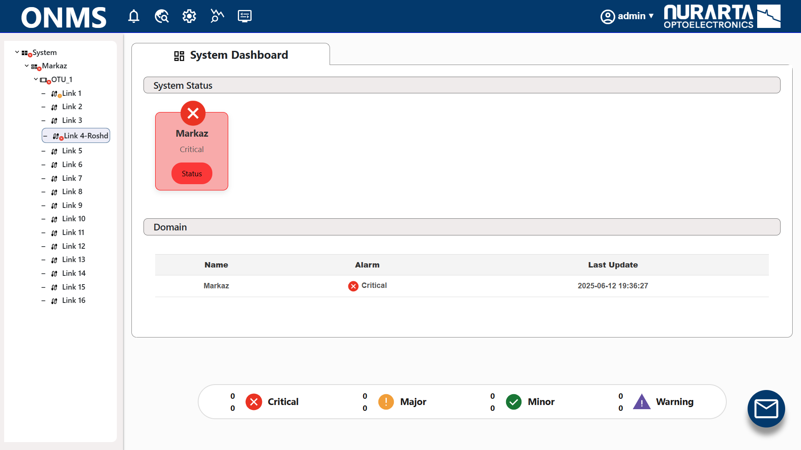
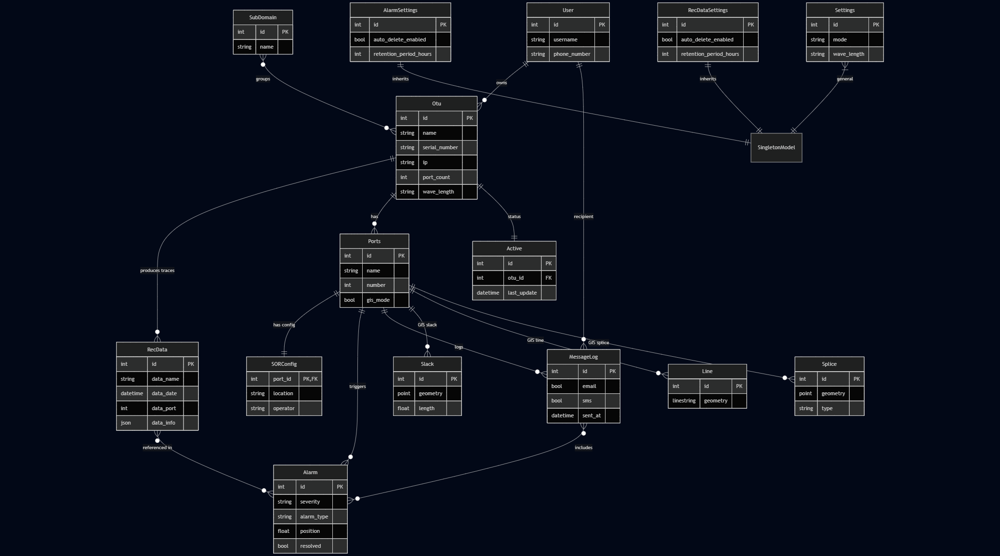
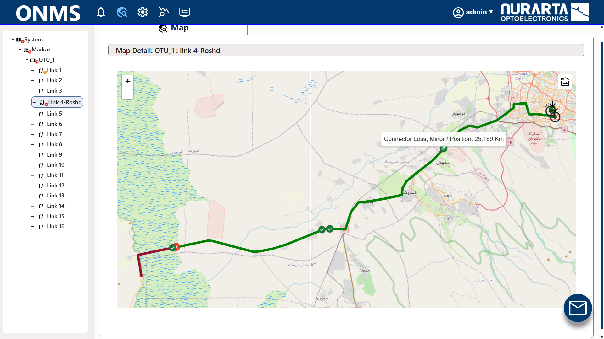
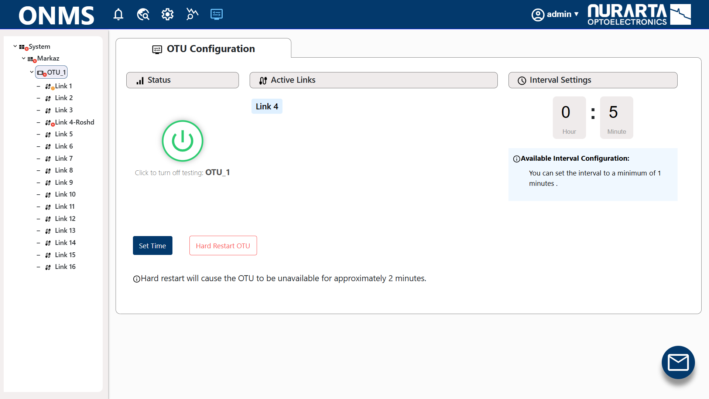
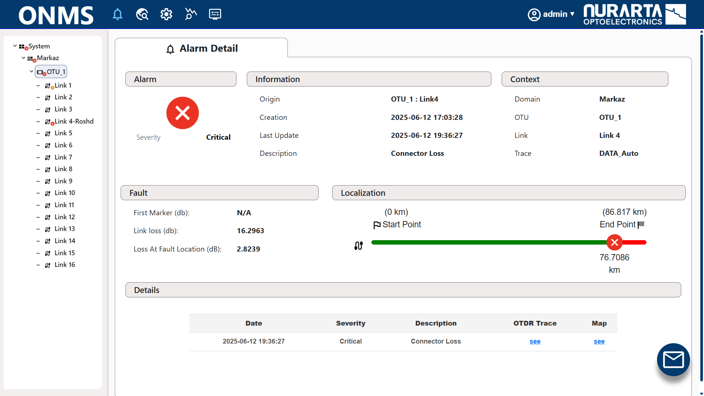

# ONMS Showcase



ONMS is an enterprise-grade network monitoring and operational management platform built with Django, React, Docker, and geospatial technologies.

This public showcase repository demonstrates selected architectural and frontend/backend concepts from the original internal ONMS project.

## System Architecture

The platform is designed around a modular backend architecture with geospatial network entities, alarm processing pipelines, and asynchronous task handling.



## Core Features

- Real-time operational dashboards
- Hierarchical network/device management
- Interactive GIS-based monitoring maps
- Offline tile support for map rendering
- Alarm and telemetry visualization
- Background task processing with Celery
- SMS notification integration
- Role-based administrative workflows
- Dockerized deployment architecture

## Tech Stack

### Frontend
- React
- React Router
- Leaflet
- Chart.js
- BootStrap / UI libraries

### Backend
- Django
- Django REST Framework
- Celery
- Redis
- GeoDjango / GIS tooling

### Infrastructure
- Docker
- Docker Compose
- Nginx
- PostgreSQL

## Architecture Overview

The platform is structured as a multi-service architecture:

- React frontend served via Nginx
- Django REST API backend
- Redis message broker
- Celery workers and scheduled background tasks
- Offline geospatial tile serving
- Environment-driven deployment configuration

## Showcase Highlights

### Operational Dashboard
Real-time monitoring dashboard for network status visualization and alarm tracking.

### GIS Monitoring
Interactive map-based visualization for fiber/network infrastructure monitoring using Leaflet and offline map tiles.

### Device Management
Hierarchical device and link management interface with operational controls and telemetry integration.

### Background Processing
Asynchronous task handling for monitoring workflows and scheduled operations using Celery and Redis.

## Screenshots

### Dashboard View


### GIS Monitoring



### Device Configuration



### Alarm Analysis



## Running Locally

### Backend

```bash
cd back-end
pip install -r requirements.txt
python manage.py migrate
python manage.py runserver
```

### Frontend

```bash
cd front-end
npm install
npm start
```

## Docker Deployment

Build and run the full stack:

```bash
docker compose -f docker-compose-prod-1.yml up --build
```

## Environment Variables

Example environment variables:

```env
DB_HOST=localhost
DB_NAME=onms
DB_USER=postgres
DB_PASSWORD=your_password
CELERY_BROKER_URL=redis://redis:6379/0
```

## Notes

- This repository is a sanitized public showcase and does not contain internal production infrastructure or sensitive operational data.
- Some enterprise-specific modules and integrations have been removed or simplified for public release.

## Project Focus

This project explores scalable dashboard systems, GIS-driven operational interfaces, asynchronous processing workflows, and production-oriented deployment architecture.
